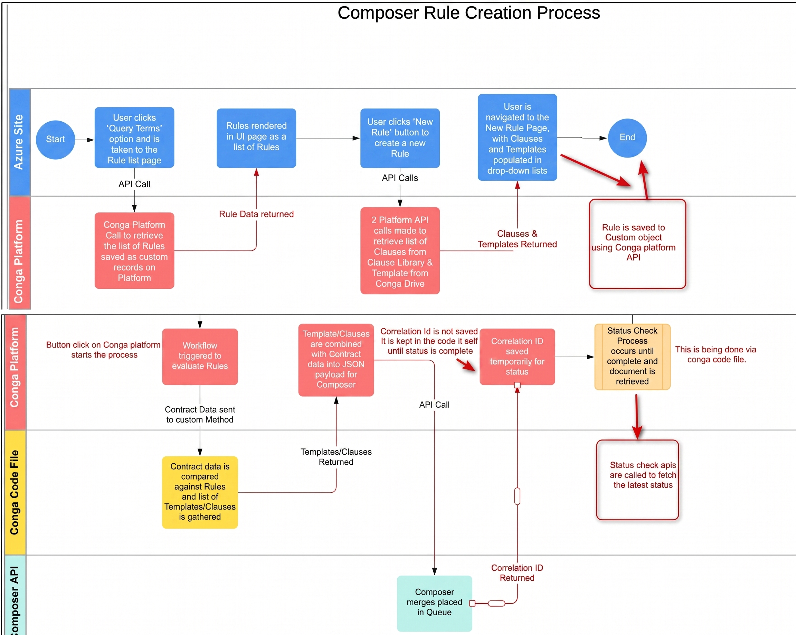
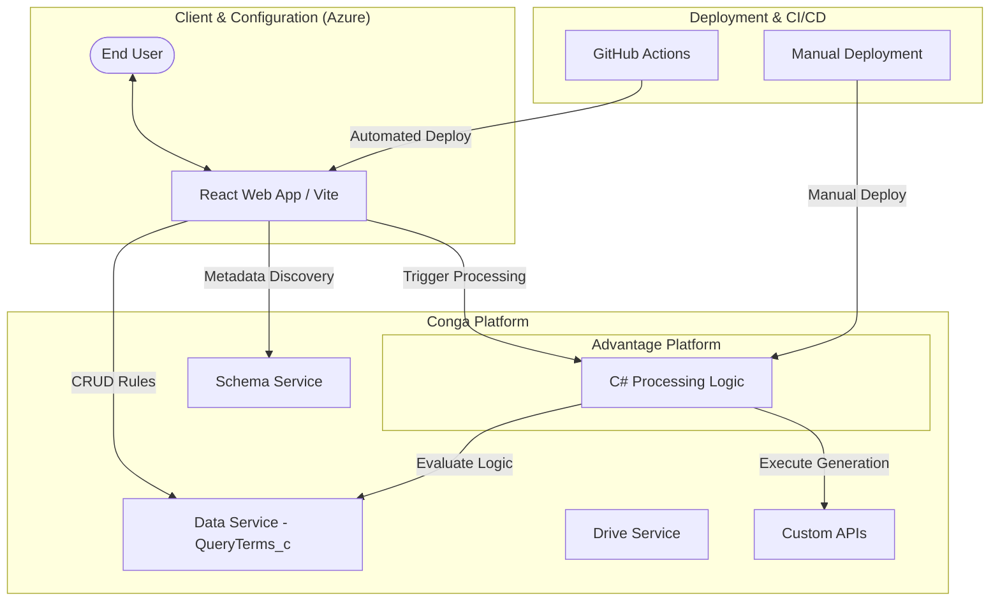

# Rule Builder POC

The **Rule Builder** is a Proof of Concept (POC) designed to provide a dynamic configuration interface and processing engine for document generation and signing workflows. It allows administrators to define complex business rules that determine which clauses and templates are used based on live record data.

## Project Structure
The project consists of two main components:
1.  **C# Backend:** A processing engine responsible for evaluating rule logic and executing the document generation/signing sequences. This component runs on the **Conga Advantage Platform** and is managed via manual deployment.
2.  **React Web App (UI):** A configuration interface used to build, manage, and store "Query Terms" (the rules).

## Architecture Diagram





## Workflow Overview
1.  **Metadata Discovery:** The React app fetches current Agreement fields via the Conga Schema API.
2.  **Rule Configuration:** Users define up to 10 conditions per rule with custom Boolean expression logic (e.g., `1 AND (2 OR 3)`).
3.  **Asset Mapping:** Rules are associated with specific Conga Templates and Clauses.
4.  **Backend Evaluation:** The C# engine evaluates these rules against live Agreement records to determine the generation path.
5.  **Automated Execution:** The system triggers the appropriate Conga API (Composer/Sign) based on the rule outcome.

## Tech Stack
- **Frontend:** React, Vite, Axios.
- **Backend:** C# / .NET.
- **Integrations:** Conga Platform APIs (Data, Schema, Drive, and Custom APIs).

## Key Features

### 1. Rule Configuration (Query Terms)
The UI allows users to define rules within the `QueryTerms_c` custom object. Each rule supports:
- **Field Mapping:** Select fields from the Conga Agreement object.
- **Conditional Logic:** Up to 10 sets of Field/Operator/Value conditions per rule.
- **Expression Logic:** Custom Boolean logic strings (e.g., `1 AND (2 OR 3)`).
- **Asset Association:** Link rules to specific Conga Templates or Clauses.
- **Signer Orchestration:** Define signers and signing order.

### 2. Schema Discovery
The app dynamically fetches metadata from the Conga Schema Service to ensure rules are built using valid field names and data types (String, Picklist, Currency, etc.).

### 3. Execution Engine
The backend processes the defined rules and triggers document generation via specialized endpoints:
- `GenerateAndSign`: Standard external signing workflow.
- `generateAndSignInternal`: Workflow for internal organizational signatures.
- `composerGenerateAndSign`: Advanced Composer-based generation and signing.

## Getting Started

### Prerequisites
- Node.js (v18+)
- Conga Platform Client Credentials (ID and Secret).

### Configuration
Create a `.env` file in the root of the React application:

```env
VITE_BASE_URL=https://your-conga-platform-url
VITE_CONGA_CLIENT_ID=your_client_id
VITE_CONGA_CLIENT_SECRET=your_client_secret
VITE_CONGA_AUTH_URL=your_conga_auth_endpoint
```

### Installation
1. Install dependencies:
   ```bash
   npm install
   ```
2. Start the development server:
   ```bash
   npm run dev
   ```

## API Endpoints Used
- **Auth:** `VITE_CONGA_AUTH_URL` (Client Credentials Grant).
- **Schema:** `/api/schema/v1/objects/Agreement` (Field metadata).
- **Data:** `/api/data/v1/objects/QueryTerms_c` (Rule CRUD).
- **Templates:** `/api/drive/v1/templates` (Drive asset selection).
- **Execution:** `/api/custom-api/v1/GenerateSignComposer/sign` (Workflow trigger).

## Rule Data Model (`QueryTerms_c`)
| Field Prefix | Description |
| :--- | :--- |
| `CNGCU_Field_[n]_c` | The API name of the field to evaluate. |
| `CNGCU_Operator_[n]_c` | The operator (equals, contains, etc.). |
| `CNGCU_Value_[n]_c` | The value to compare against. |
| `CNGCU_Expression_Logic_c` | The logical combination of conditions. |
| `CNGCU_TemplateId_c` | The ID of the template to generate. |
| `CNGCU_Clauses_c` | The name of the clause to include. |
| `Signer_c` / `Signing_Order_c` | Signing metadata. |

## Hosting and Deployment

The Rule Builder POC utilizes a hybrid hosting model across Microsoft Azure and the Conga Advantage Platform.

### Frontend (Azure)
- **Hosting:** The React UI is hosted as an **Azure Static Web App**, providing global distribution and integrated SSL.
- **Deployment Workflow:** Managed via **GitHub Actions**:
    1.  **Trigger:** A push or pull request to the `main` branch.
    2.  **Build:** Executes `npm run build` for the React frontend.
    3.  **Deploy:** Uses the `Azure/static-web-apps-deploy` action to sync the build folder.

### Backend (Conga Advantage)
- **Hosting:** The C# processing engine is hosted directly on the **Conga Advantage Platform**.
- **Deployment Workflow:** Managed via **Manual Deployment**. Updates to the C# rules processing logic are deployed independently of the frontend automated workflow.

### Environment Configuration
When hosting the frontend in Azure, environment variables (like `VITE_CONGA_CLIENT_ID`) should be configured in the **Configuration** section of the Azure Static Web App in the Azure Portal.

## Demo Notes
- For Internal Button FLow: Data is required on Fields: Template selection, Routing, Internal user, Customer Name, Customer email
- Also disable any pop-up blockers
- Ensure Internal and external users have different email
## TODO

- [ ] Support deployment of the React Web App to the Conga Advantage Platform.
